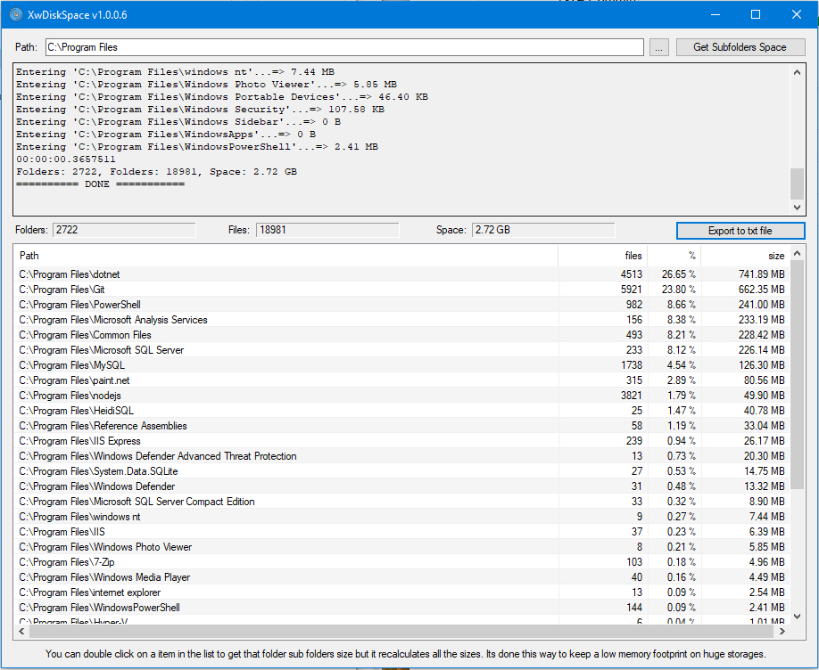

# XwDiskSpace

A simple disk space investigator  
No bells, no whistles  

So, were is the difference to other softwares that also do this?  

The necessity came once i had to check the space on huge storages with hundreds of millions on files.  
Existing tools try to keep a complete space representation, all subfolders, all files.  
This consumes all RAM available, ans i never was able to check the storages.  
  
This tool counts all the space in a subfolder, but only keeps one level in memory.  
Once you identify wich subfolder uses more space, you can then check that one.

Sure, it will have to check the storage multiple times but at least it can be done with very little memory.

## In case you are feeling generous  
